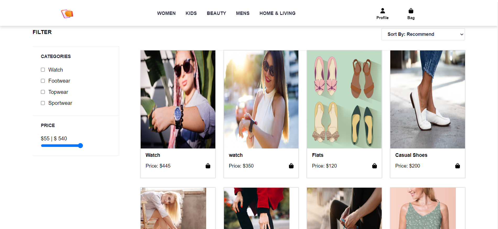
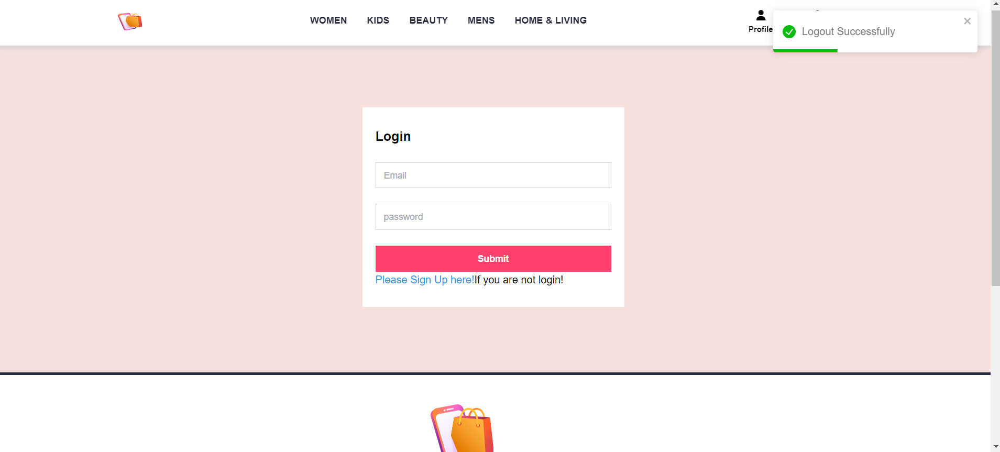
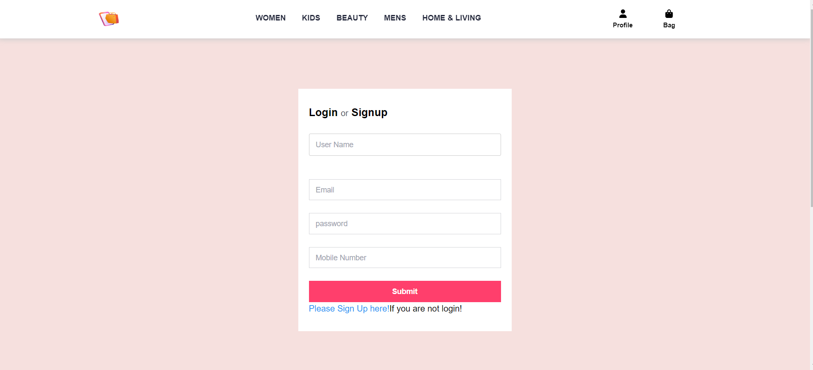
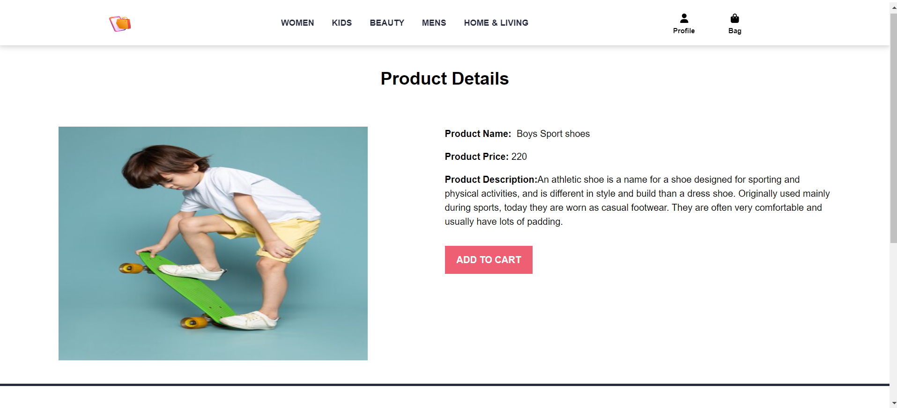
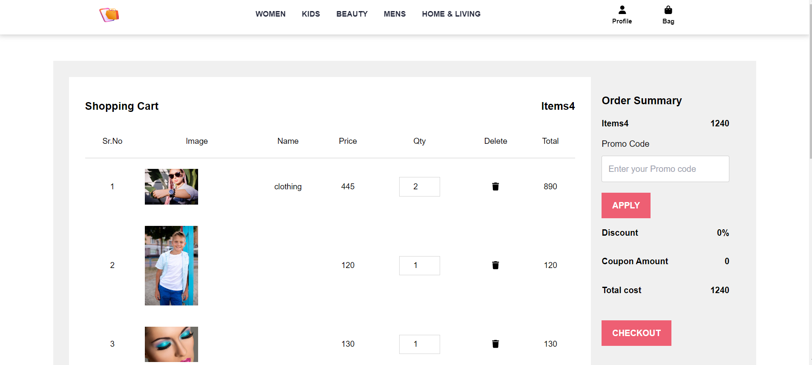
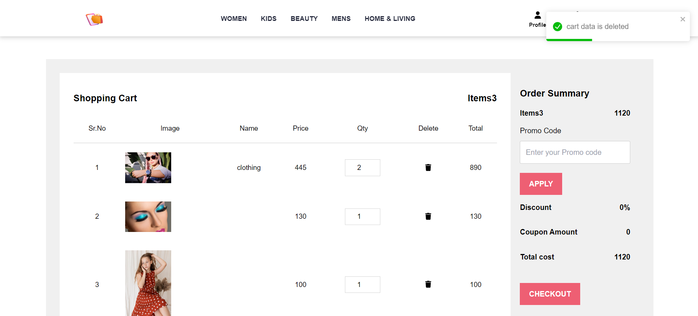

# Ecommerce

# Description

This application is based in ecommerce where user can but products which is related to wome ,men ,kids ,beauty and Home Decor.we have used technology for MERN stack, with a React front end, MongoDB database, and Node.js/Express.js server and API. in thsi application , we can add products buy APi And admin panle .In admin panel where admin can add their products and view , admin can view user registration , coupon where can add special occasions.we have used the stripe payment package where user can paymnet by stripe

* [GitHub Repository](https://github.com/LipikaManglaa/ecommerce)
* [Deployed GitHub IO]  git@github.com:LipikaManglaa/ecommerce.git

Live Heroku Link:https://gruesome-chupacabra-93812-89264ae7b4ee.herokuapp.com/

## Table of Contents

  
* [Description](#Description)

* [Screenshots](#Screenshots) 

* [Technologies-Used](#Technologies-Used)

* [Features](#Features)   

* [Installation](#installation)
  
* [Instructions](#Instructions) 
          
* [Questions](#questions)
 
* [License](#license)  

### Features
1) its front page of website

2) in here, you can filter products according to price and categories

3) can login here

4) if you are no login , can sign up here

5) product details page

6) after adding product , cart page here , can add coupon code as well

7) if you dont need any prodcut in ypur cart , can delete 

### Technologies-Used
  *
  * Express.js
  * Node.js
  * MongoDB
  * Mongoose
  * jsonwebtoken
  * jwt-decode
  * bcrypt
  * Cors
  * dotenv
  * Multer 
  * Slugify
  * Stripe
  * react-toastify
  * slick-carousel

### Installing

* To install this code, download the zip file, or use GitHub's guidelines to clone the repository. 

* Node.js and MongoDB is required to run the application

* To install dependiencs,run command npm i

* in client foler , run npm i 
* In server folder, run npm i

## Instructions
If you would like to see how to create Ecommerce API then you can check my github repo and let you know  how to cretae it

## License
This application is covered under the MIT license

## Questions
Created by: LipikaManglaa

If you have any further questions please feel free to contact me at lipika.mangla.web@gmail.com
